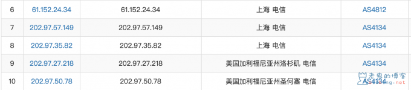
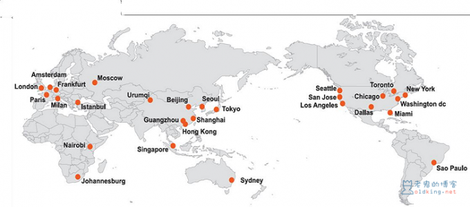
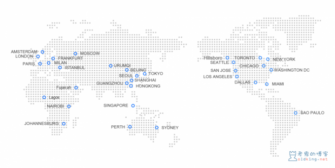
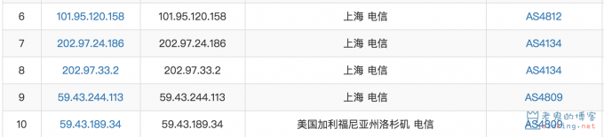
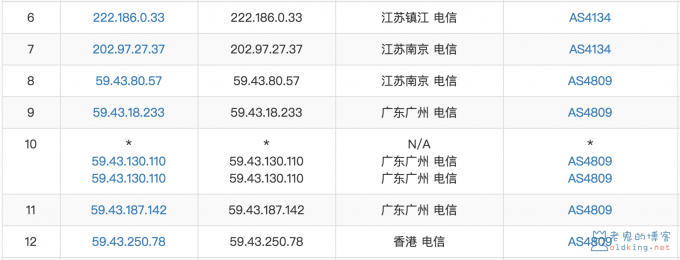
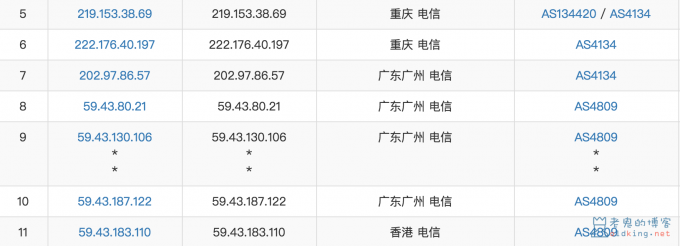

# 什么是 ChinaNet,CN2,GT,GIA？

## 前言

本文讲从几个方面去讲述中国电信出口网络的情况，阅读本文后让读者对使用中国电信连接海外网络中常用的术语与基本知识有一个大致的了解，以及当读者在购买国外高质量主机的时候，有个基本的链路判断，怎么去分辨，ChinaNet，CN2，CN2 GT，CN2 GIA 等线路。

老鬼的博客原创文章保留所有权利，允许提前告知并保留原文链接的转载，任何无视版权的行为将吃到搜索引擎的 DMCA 投诉，请了解。

## 基本

中国电信\(China Telecom\)，是中国最大的互联服务提供商，截止2018年1月，中国电信的总出口带宽数为 3.6 Tbps，为互联网用户提供高速稳定的全中国资源访问服务。目前，中国电信骨干网的三大国际出口分别是，北京，上海，广州，全国的出口网络最后都会汇集到这三个出口点。

## 分类

### ChinaNet

全球最大的中文资源互联网络 ChinaNet，也叫 163 骨干网，AS4134，要纠正的一点是，很多人缪传一个"CN1"的叫法，这是毫无根据的，Chinatelecom Next Carrier Network，简称 CNCN，再简化为 CN2，CN1 这种叫法可能是看着 CN2 类比出来的，但是官方没有过这种叫法。但如果看到这种说法，你可能知道说的是 ChinaNet 也叫 163 网络。ChinaNet 为超过 8000 万宽带用户服务，同时向全球用户提供超过70%的中文网站的中文互联网资讯。绝大部分的出口带宽都是这种网络，ChinaNet 主要定位于承载普通质量的互联网业务，因为他基建早，带宽大，且足够便宜。  
我们来用 Traceroute 路由表来看一下走 163 网络的出口路由情况。

可以看到无论是从出发地点到省级接口，省级接口到上海海外出口，然后到美国，走的都是 AS4134，ChinaNet 网络。

### Chinatelecom Next Carrier Network\(CN2\)

CN2，即是 ChinaNet 之后由中国电信发展的下一代承载网，AS4809，主要是为了提供更高质量要求的中国电信骨干承载网络而建立的工程。运营全球互联网转接服务，能够实现欧洲、北美和亚洲之间高速、大容量、安全、稳定转接服务。CN2 相比较 163 网络，带宽小得多，小是相对的因为相对受众少，但稳定高速，定位于承载企业级别的 VPN 业务，常用于政府，企业，金融类、游戏类等对延时敏感的业务。它提供更高质量的网络服务，接入 CN2 网络价格普遍要比 ChinaNet 贵上许多。  

下图为 2016 年由中国电信国际有限公司官网提供的全球 CN2 接入点

下图为截止 2018 年 8 月中国电信国际有限公司官网提供的全球 GIS 接入点

可以看到中国大陆有四个出口点，北上广三个，另外还有一个乌鲁木齐，比较少见的哈塞克斯坦 CN2 网络，走的就是乌鲁木齐出口，即使这个也会先走北上广三个点，再跳到乌鲁木齐出口。  
CN2 上又有很多的产品，主要包括 CN2 GT，CN2 GIA 两类。这里是否叫 CN2 GT 和 CN2 GIA 待考证，因为之前还流行叫半程 CN2，和全程 CN2 的叫法，可以肯定的是有两种运行在 CN2 的服务，一种价格便宜省级骨干走163，出口才走 CN2，一种价格昂贵全程走 CN2，目前主机圈主流叫法 CN2 GT 和 CN2 GIA。另外还有单程双程是另外一种分类，后面讲。

### **CN2 GT**

GT 英文是 Global Transit，为全球客户提供访问全球互联网资源的转接服务。提供给全球的通讯运营商，截止目前，中国电信已经与国际Tier1/2 运营商以及主流OTT建立超过5000G的互联带宽，本身接入网络是 ChinaNet\(AS4134\)，但是直连中国电信 CN2\(AS4809\) 的一个服务。CN2 GT 中国国际出口拥有自己的单独线路，但是在国内的链路还是使用的 163 骨干网络。

### **CN2 GIA**

GIA 英文是 Global Internet Access，为企业客户提供优质的中国方向互联网专线接入服务，注意 GIA 专指与中国的专线服务。主要是提供给企业的优质网络，本身接入网络 CN2\(AS4809\)，出口全程 CN2\(AS4809\) 路由，国际网路高速稳定链接中国内地网络。这种带宽的质量应当是电信网络最好的，但是缺点也比较明显，整个 GIA 的出口带宽较小，在较大流量攻击的时候更容易导致整个 GIA 下的网络波动。GIA 的主要优势是回国有单独的线路，高优先级，高质量，但接入价格较贵。

### **单程（单向） CN2**

我们知道，路由是双向的，去和回，单程 CN2 就是指，只有一边的走 CN2，另一边走的其他的网络。可能有两种情况  

* 去程 CN2，回程 ChinaNet。这种情况常见，主要是很多主机商拿来打 CN2 广告的噱头，CN2 去程能够很容易被评测出来。但其实，去程 CN2 并没有什么太大作用只是减小去了去的时延，因为我们知道在普通用户的网络访问情况中，回来的流量要比去的要大得多，单程 CN2 要便宜一些，因为流量使用的少，比纯 ChinaNet 算下来还是要贵一点，有点鸡肋的感觉，弃之可惜，食之无味。
* 去程 ChinaNet，回程 CN2。这也是一种组合的单程 CN2，这种情况，主要是为了兼顾抗 DDoS，速度和价格三方面，纯 CN2 网络相对脆弱，遭遇量大的 DDoS 后，很快就会把链路占满，造成出口拥塞（CN2 链路遭遇大量 DDoS 攻击时也会自动切到 163 网络）。163 网络带宽容量大，从中国内地出去的出去的攻击能够被很好的承载，而回程又走 CN2 线路，加快速度。普遍上，单程回 CN2，比单程去 CN2 花费高，因为回程的量在互联网服务中占多数。这种情况下，是综合抗DDoS（如果有），速度，价格的折中的最优解，适合容易遭受攻击，且需要速度的需求，当然最好的当然还是双程的。

### **双程（双向） CN2**

去程回程都走 CN2 网络。其中包含 CN2 GT 和 CN2 GIA。

单程同理，包含 CN2 GT 和 CN2 GIA 两种。

### **CN2 延迟排序**

根据中国电信国际有限公司官网数据提供的 2018 年 5，6，7 月三个月的 CN2 质量平均情况（未知端点城市，看着像上海，也可能是几个城市平均下来的数据），理论上可看作为最佳情况下，常见 CN2 节点城市与中国连接延迟排序（ms）

| 香港 | 首尔 | 东京 | 新加坡 | 莫斯科 | 圣何塞 | 洛杉矶 | 法兰克福 | 西雅图 |
| :--- | :--- | :--- | :--- | :--- | :--- | :--- | :--- | :--- |
| 28.27 | 60.37 | 67.32 | 67.65 | 134.78 | 166.44 | 175.62 | 180.65 | 185.47 |

### **怎么判断 CN2 GT 和 CN2 GIA**

无论接入的是 GT CN2 还是 GIA CN2，都保证国家与国家之间的传输在 CN2 骨干网内进行，路由中有 ip 开头为 59.43.\*，AS4809，首先即判断有一段为 CN2 网络。CN2 上承载了两个较为常见的套餐，那怎么判断是哪一种呢，我们来分析几种特殊情况。

* CN2 GT 的省级出口为 202.97 节点（163骨干网节点），在跨境时才进入 CN2 骨干网，国际跨境节点为 59.43 开头。即使处在 CN2 节点城市，如上海，也会先走 202.97 节点。以此类推其他城市，不再列出。可见目前所有的 CN2 GT 路由都会有 202.97 开头的 ip

* CN2 GIA 在部署开通有 CN2 节点的省份城市接入该省的省级 CN2 节点，在暂未部署 CN2 节点的省份城市则就近接入北上广节点。\(此点不够严谨，特例情况除外，详情看评论区，感谢 **Test IP** 指出\)
  * 本省有 CN2，但非节点城市，如江苏镇江，经南京 202.97 节点进入江苏南京 CN2 节点，最后进入广州 CN2 出口节点。
  * 本省无 CN2，如重庆，经过重庆 163 节点，进入广州 202.97 节点，然后接入广州 CN2 节点

* 所以这两种情况虽然是 CN2 GIA 但也会先走 202.97，而如果是在上海和其他 CN2 节点城市，这种情况下的 GIA 才不会有 202.97 出现。所以有的说法里面讲有 202.97 就是 CN2 GT 的这个观点，是错误的。
* 截止目前，我所知的国内走 CN2 节点城市有，成都，南京，西安，武汉，乌鲁木齐，广州，上海，北京。
* 了解了以上知识点之后，最简单判断 GT 还是 GIA 的方法，直接用上海电信 traceroute，有 59.43 先是 CN2，再无 202.97 即为 GIA。

## 其他

### 补充一

这里要分清的一点是，ChinaNet 和 CN2 是骨干网的分类，而以下四个则是，中国电信提供的国际互联网服务 Global Internet Services（GIS）下的四个产品，具体不细说了，有兴趣自查。所以说 CN2 GT 和 CN2 GIA 可以理解为运行在 CN2 承载网上的 GT 或 GIA 服务。  

以下四段摘自中国电信国际有限公司官网，GIS 产品介绍。

#### **Global Transit（GT）**

为全球客户提供访问全球互联网资源的转接服务。

**Global Internet Access\(GIA\)**

为企业客户提供优质的中国方向互联网专线接入服务。  

**ChinaNet Paid-Peer**

为全世界运营商和OTT用户提供中国电信中文互联网资源的最短路由接入服务。

**China Access**

为全球客户提供一站式的中文互联网资源接入服务。

### 补充二

无论什么网络，路由都不是固定，路由是时刻动态的，随时会变，这个变，由你自身（比如本地精品网络CN2用户），或者你连接的网络（比如提供CN2的服务器）与通信提供商签约的合同而定，也由网络容量，稳定情况而定。

## 最后

中国电信的出口网络，依然是占中国出口网络带宽的几乎一半之多，但是使用人数也是最多的，从使用情况经验上来看，呈现高峰明显拥堵，低峰充足。

