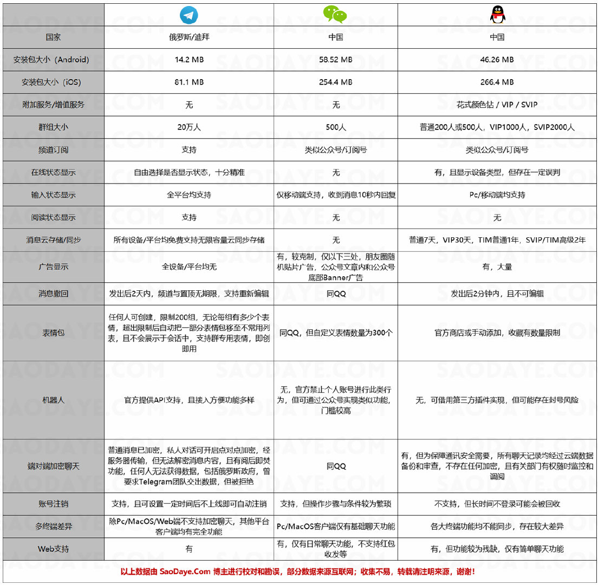
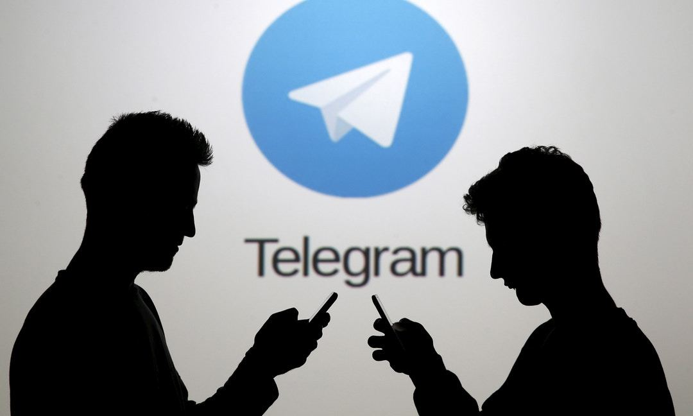
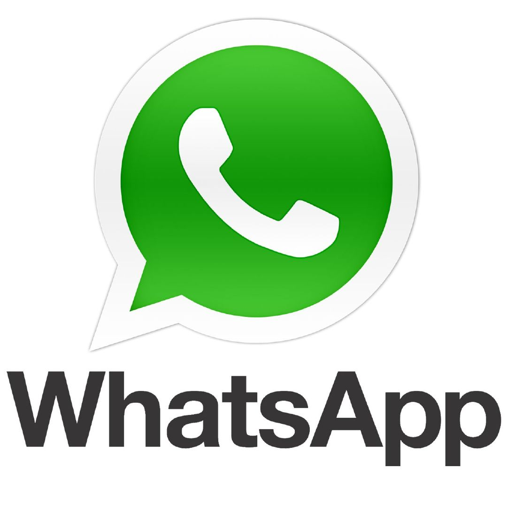

# 为什么使用Telegram

> 简介

Telegram是一个跨平台的即时通信软件，它的客户端是自由及开放源代码软件，但是它的服务器是专有软件。用户可以相互交换加密与自析构的消息，发送照片、影片等所有类型文件；

官方提供手机版、桌面版和网页版等多种平台客户端；同时官方开放应用程序接口，因此拥有许多第三方的客户端可供选择，其中多款内置中文；

微信（WeChat）是腾讯公司于2011年1月21日推出的一个为智能终端提供即时通讯服务的免费应用程序，腾讯QQ是腾讯公司开发的一款基于Internet的即时通信（IM）软件；

> 功能差异对比图

1、加密技术过硬

* Telegram 为一对一的聊天提供端对端加密，加密模式是基于256位对称AES 加密，RSA 2048 的加密和Diffie-Hellman 的安全密钥交换协议；
* 协议极其优秀，兼具数学和工程之美，不仅加密基础非常完善，在工程上也很出色，Telegram传递的消息为函数，可扩展性相当强；
* Telegram自信自己的加密方式绝对安全，并且承诺：只要有任何人成功破解已拦截的通讯内容，就提供10万美元的奖金。
* 目前只有一个人拿到过这笔奖金，不过他发现的也仅是一个可能会导致问题的隐患。
* 不仅如此漏洞收购平台Zerodium 对Telegram的漏洞还开出了最高 50 万美元的报价，Telegram的安全程度可见一斑。

2、功能设置贴心

* 聊天记录不支持服务器保留；
* 支持设定聊天记录定时销毁；
* 支持一键删除账户，删除了账户后，所有相关的资料也都一并销毁；

3、永久免费

* 免费、非盈利、永不销售广告、拒绝接受外部投资；
* 不会发生被收购的情况，落入他人之手，改变公司原有的安全通讯初衷；

4、创始人牛逼上天

* Telegram的创始人俄罗斯富豪Pavel Durov也是欧洲最大社交网络VK的创始人，高富帅，聪明有个性，在俄罗斯国内，以跟普京爸爸唱反调而著称。
* 他在接受采访时表示，Telegram就是为了隐私和安全而生的，绝不向任何势力妥协。

5、太多太多的实用功能请自行体验

其实Telegram在国内属于小众产品，为何？因为不可抗因素（都懂的）导致部分童鞋无法正常使用，也说明过滤了一部分小白用户，所以，Telegram的使用者大多是极客科技一族，

和他们交流也能学到不少东西，综合来看，利大于弊。

Telegram出现前，WhatsApp曾是大众比较看好的一款加密通讯软件，大部分的用户认为 WhatsApp 是安全的。但自从 WhatsApp 被Facebook收购，WhatsApp的安全性就被打上了大大的问号。

为啥呢，因为“后爸”Facebook 的生意要想赚更多钱，那就很有可能出于利益考虑，利用WhatsApp 的数据。毕竟数据的金山就放到你面前，唾手可得，换你你能不动心么？

> 相比之下

国内某知名公司的其中一项服务就是对加密的通讯内容进行解密读取，可以“随心所欲”进行通讯内容监控。其监控范围之广、数据挖掘之深，令人咂舌。

其实通讯软件自身的安全程度其实仅为安全问题的一部分。举个例子，如果手机没有锁屏密码的保护，或者密码干脆就是123456，那么不管用多安全的通讯软件都不能保证信息不被窃取。

不管怎么说，Telegram在保护用户通信安全和自由方面，现在来看已经做的非常牛逼了，但至于是有关部门笑到最后还是telegram，只有等待时间的流逝，未来…

