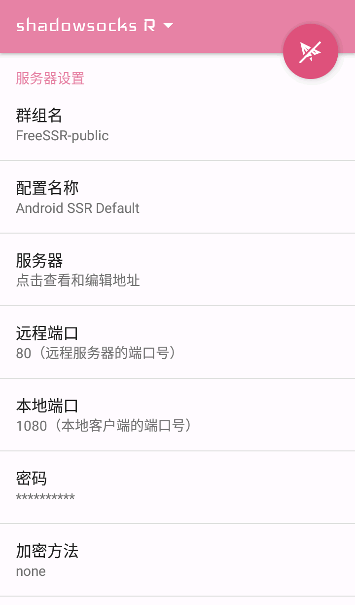
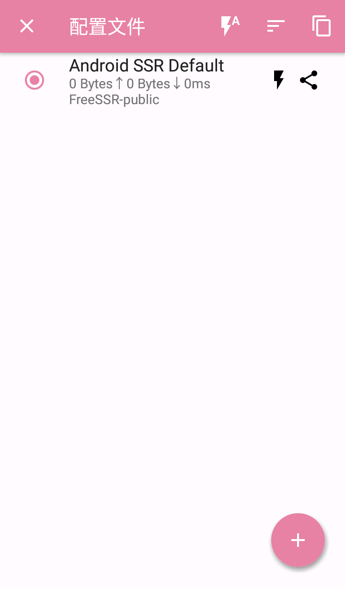
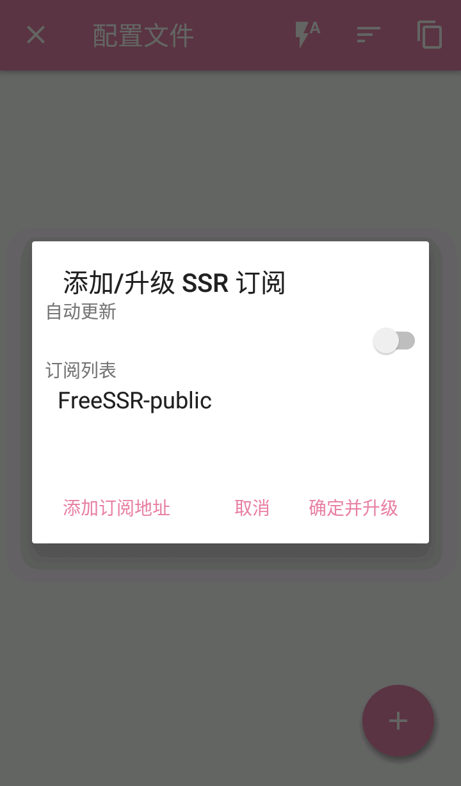
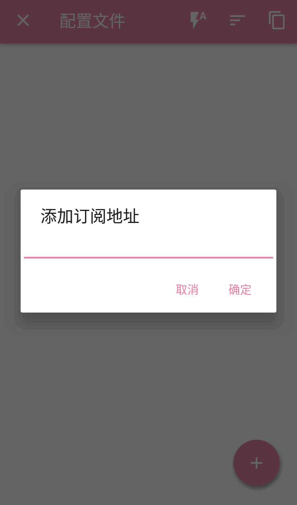
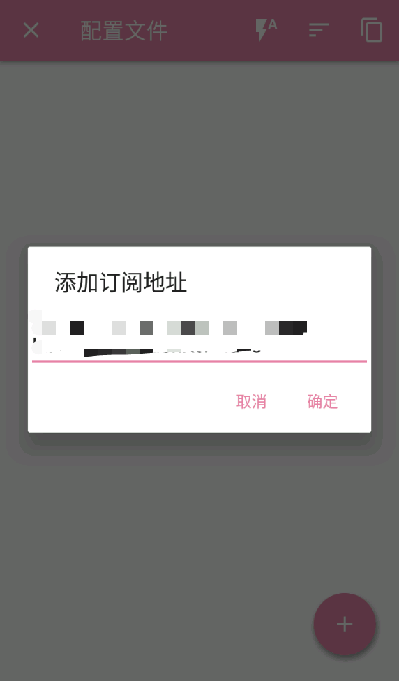
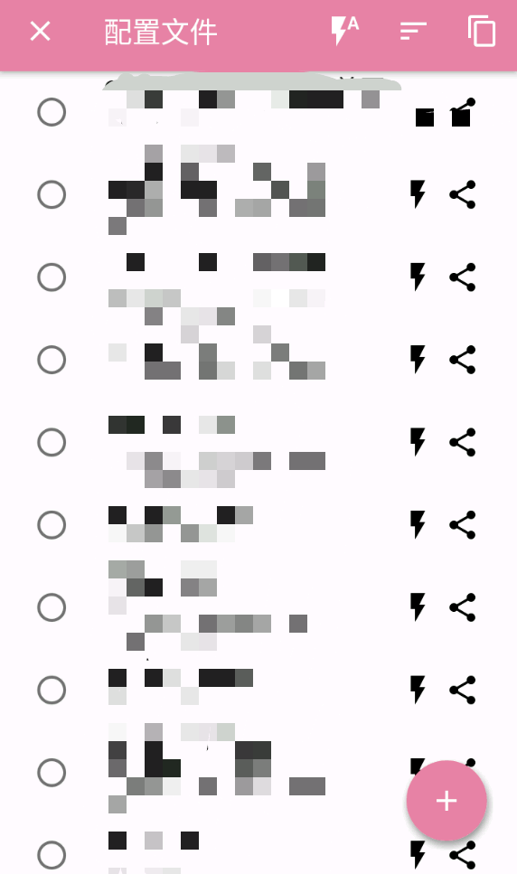
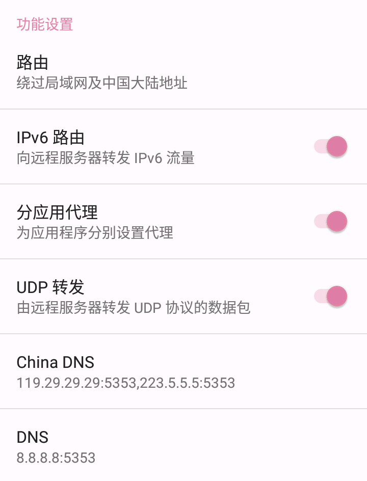

# ShadowsocksR - Android

* 系统要求：Android 4.4 及以上
* 设备要求：Android Phone / Tablet

### 一. 打开SSR，并进入节点列表

然后**点击顶部**的 **ShadowsocksR ⬇** 区域进入**节点列表**

### 二. 节点列表界面 进入 添加订阅 界面

节点列表页面**点击**底部的 **+** 按钮，并选择 **添加/升级 SSR 订阅**

### **三**. 在添加订阅界面中 删除 软件自带无效订阅

默认有一个 **FreeSSR-piblic** 的**无效订阅**，~~建议~~**一定要 左右滑动** 将其**删除，**

**否则在下一步更新订阅节点时，卡住，切记，删除这条无效订阅。**

### **四**. 在**节点列表中再次打开**订阅界面

再次**点击** 节点列表页面底部的 **+** 按钮，

选择 **添加/升级 SSR 订阅**，在订阅列表中点击 **添加订阅地址。**

### **五**. 在订阅界面中 添加订阅

**长按**文本框空白区域，选择**粘贴**，将**订阅地址**粘贴到**文本框**中。

点击**确定，完成订阅添加。**

### **六**. 在订阅界面中 获取到订阅信息后 更新/升级 节点信息

添加订阅后，**等待**几秒（**具体时间取决于您的网络环境**），

您将会看到 **几鸡** 的**订阅信息**，

勾选**自动更新**并点击**确定并升级**即可导入节点信息并自动更新。

### **七**. 选定可用节点并配置设定

导入接入点信息后，返回到**节点列表页面**，

选择一个**可用**节点，进入**节点详细界面**开始**配置设定**。

**滑动屏幕**找到**功能设置**功能区，打开**UDP 转发**和**IPv6 路由**，

并将**路由**设置为**绕过局域网和中国大陆地址**。

### **八**.  选定可用节点并开启爱国富强

导入接入点信息后，返回到**节点列表页面**，

选择一个**可用**节点，进入**节点详细界面**。

在**节点详细界面**点击右上角的**纸飞机图标**连接，

**如果是首次连接**，则系统会弹出如下的**提示框**，请点击**确定**。

**开始爱国富强。**

\*\*\*\*

