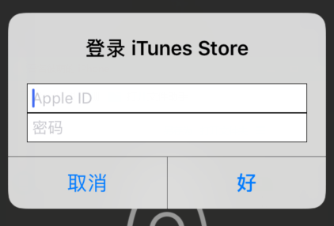
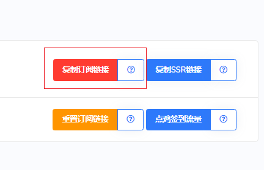
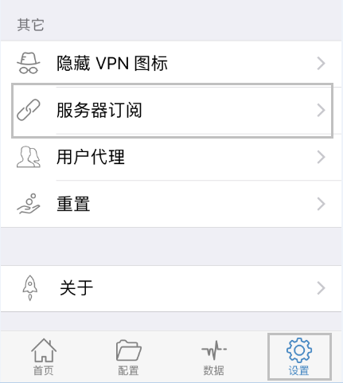
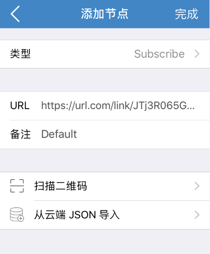
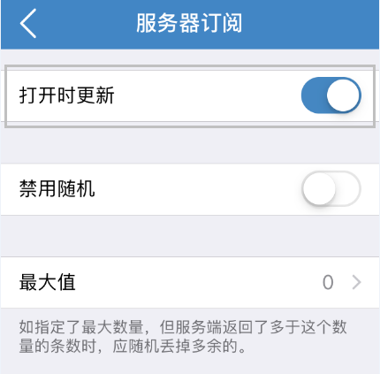
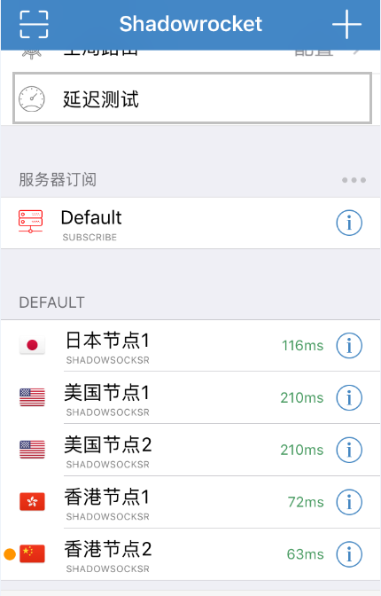
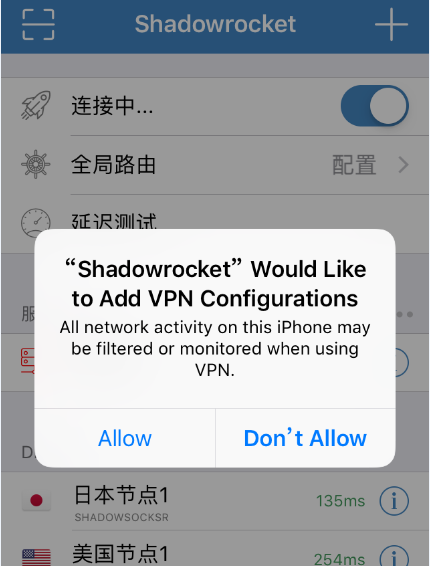

# Shadowrocket

### 1.下载登陆软件

Shadowrocket 中国大陆区苹果商店已经下架，需要自行下载（注意是收费的），  
需自行注册非大陆账户后马云买苹果预存卡并购买，或找马云或各类网络分享。  
比如：[https://haobang.me/](https://haobang.me/)

使用自己或找到的账户登陆苹果商城并下载软件。

### 2.复制订阅链接

在网站用户中心里，复制订阅链接

### 3.选择设置功能

点击右下角「设置」，找到并点击「服务器订阅」；

### 4.选择订阅类型

类型选择「Subscribe」，粘贴节点订阅链接至「URL」中，并填写好「备注」，点击右上角「完成」；

### 5.开启更新订阅

开启「打开时更新」选项；

### 6.点击测试延迟

返回到首页，点击「延迟测试」，选择一个低延迟的节点；

### 7.启动爱国富强

首次启动会提示“Shadowrocket 想要添加 VPN 配置”，点击「Allow」后验证密码，最后即可科学上网。

​

