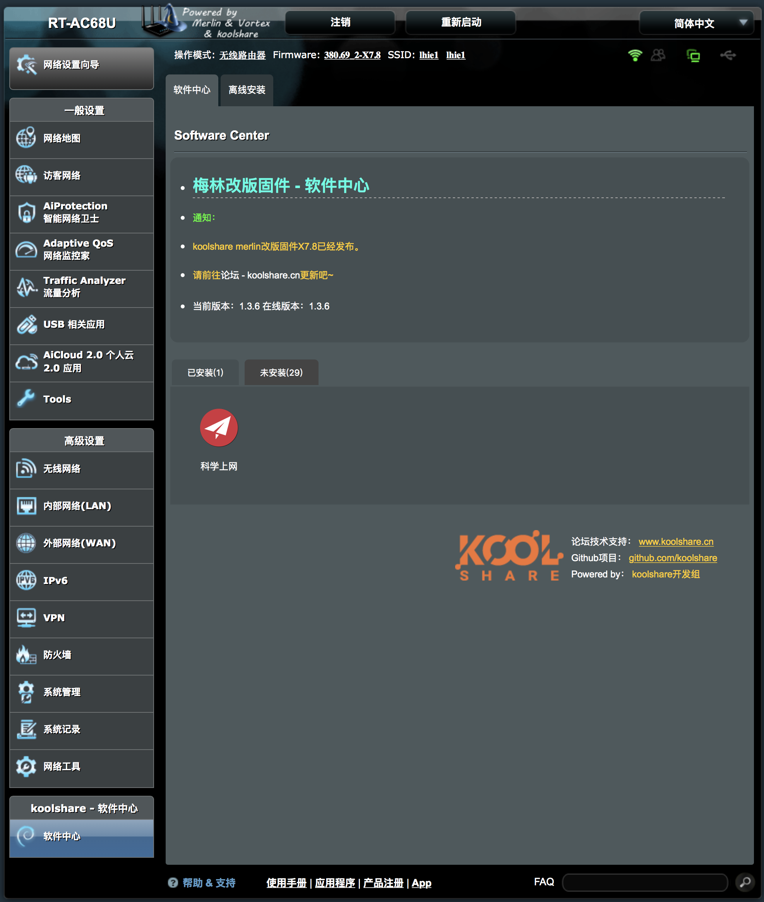
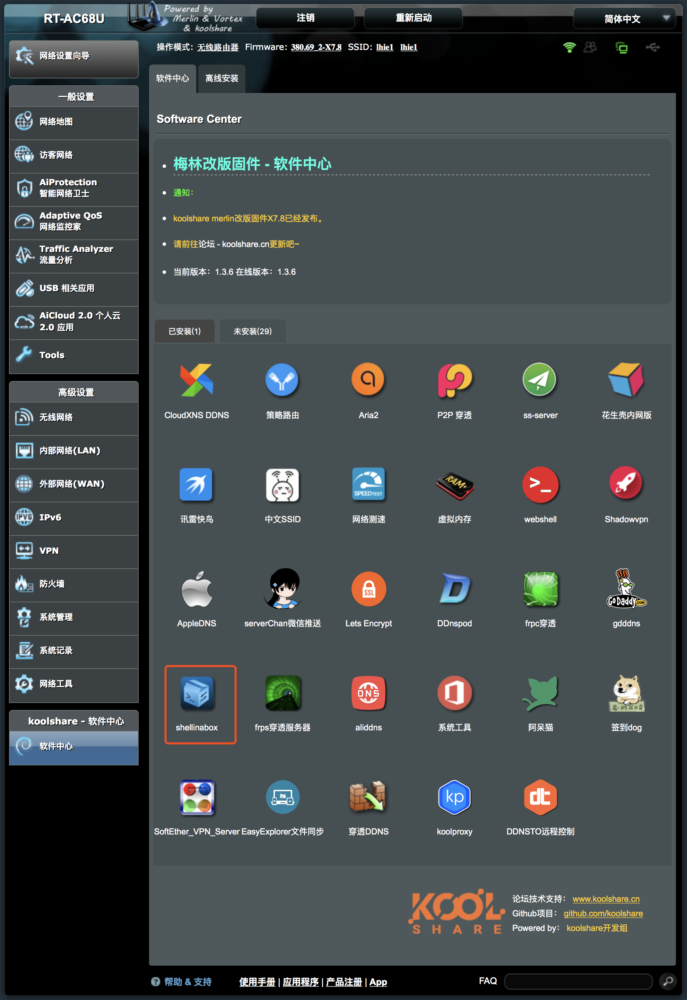
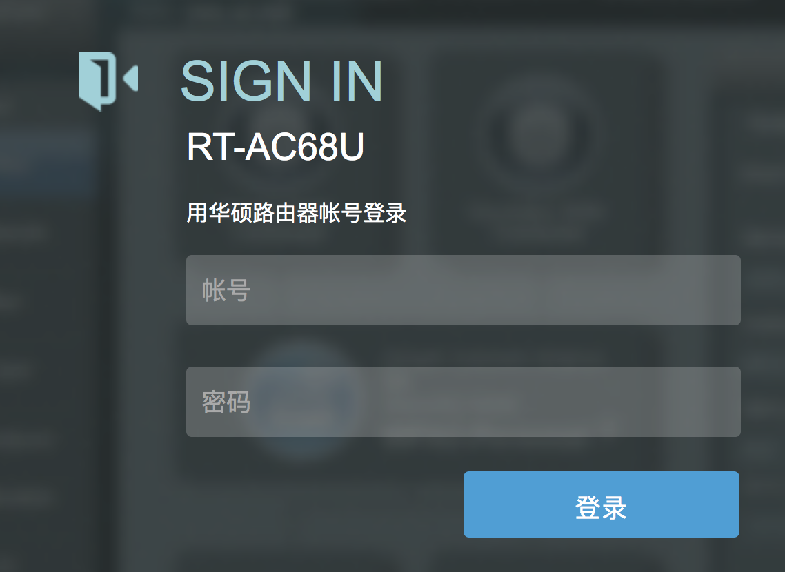
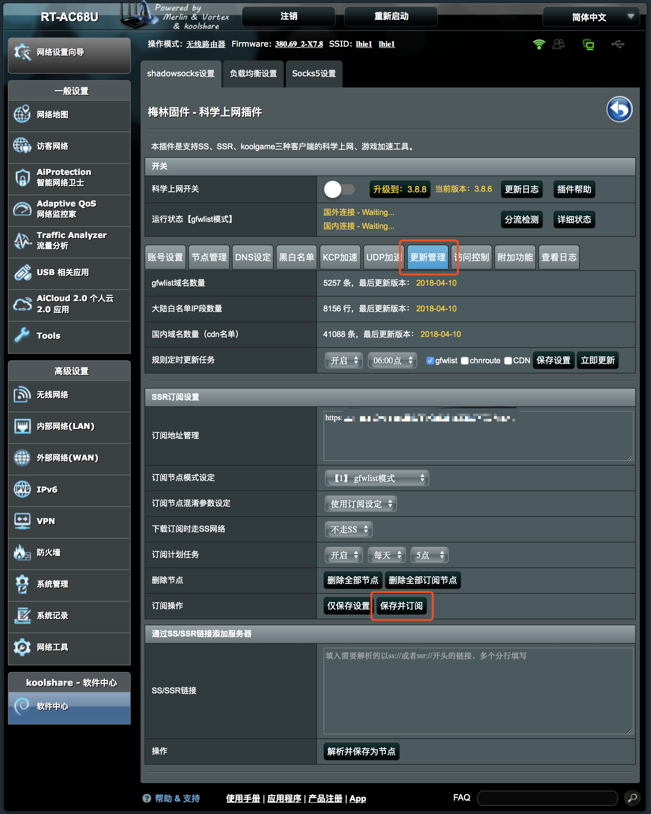
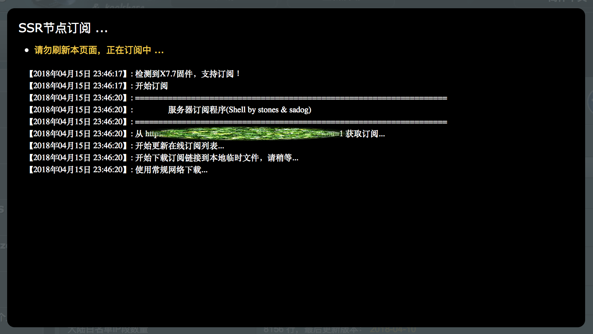

# Merlin\|梅林


此客户端存在严重的稳定性与可靠性问题。


### 一. 安装

#### A. 在线安装

通过**浏览器**访问 **Koolshare Merlin ROM 管理页面**，

在管理页面底部点击 **软件中心** -&gt; 点击**未安装选项卡** -&gt; 点击 **科学上网** 进行**安装**。

#### B. 离线安装


因**神秘不可抗因素**，商店有时会下架 **科学上网**插件，可**离线安装**。


通过**浏览器**访问 **Koolshare Merlin ROM 管理页面**，

在管理页面底部点击 **软件中心** -&gt; 点击**未安装选项卡**，

点击 **shellinabox** 进行 **SSH 网页客户端** 安装。

点击 **已安装选项卡** 中的 **shellinabox** 进入 **SSH**。

依次输入 **Koolshare Merlin ROM 管理页面**的**账号**和**密码**，

\*\*\*\*

> cd /tmp && wget --no-check-certificate https://raw.githubusercontent.com/koolshare/koolshare.github.io/acelan\_softcenter\_ui/shadowsocks/shadowsocks.tar.gz && tar -zxvf /tmp/shadowsocks.tar.gz && chmod +x /tmp/shadowsocks/install.sh && sh /tmp/shadowsocks/install.sh

### 二. 配置与使用

点击**已安装 选项卡**中的 **科学上网** 进入**插件管理页面**。

如果是**第一次**使用此插件，则可能弹出此**会话框**：

点击 **更新管理** 按钮进入**更新管理页面**，

将 **订阅地址 粘贴**于**订阅地址管理右侧**的**输入框**中，点击 **保存并订阅** 按钮。

**订阅中...**


由于**普通家用路由器**其使用的 **CPU** 大都为 **MIPS** 或 **ARMv7** 架构，

**其性能可能不足**，因此**可能无法达到较高速率**。


以下是**各常见路由型号**大致**连接速率**：

| 型号 | 品牌 | 大致连接速率 |
| :--- | :--- | :--- |
| R6300v2 | NETGEAR | 30Mbps |
| R6400 | NETGEAR | 30Mbps |
| R6900 | NETGEAR | 60Mbps |
| R7000 | NETGEAR | 70Mbps |
| R8000 | NETGEAR | 未经测试 |
| R8500 | NETGEAR | 110Mbps |
| RT-N66U | ASUS | 未经测试 |
| RT-AC56U | ASUS | 20Mbps |
| RT-AC66U | ASUS | 30Mbps |
| RT-AC68U | ASUS | 60Mbps |
| RT-AC87U | ASUS | 70Mbps |
| RT-AC88U | ASUS | 70Mbps |
| RT-AC86U | ASUS | 180Mbps |
| RT-AC1900P | ASUS | 70Mbps |
| RT-AC3100 | ASUS | 未经测试 |
| RT-AC3200 | ASUS | 未经测试 |
| RT-AC66U-B1 | ASUS | 60Mbps |
| RT-AC5300 | ASUS | 120Mbps |
| GT-AC5300 | 玩家国度 | 250Mbps |
| EA6200 | Linksys | 未经测试 |
| EA6400 | Linksys | 未经测试 |
| EA6700 | Linksys | 未经测试 |
| EA6500v2 | Linksys | 未经测试 |
| EA6900 | Linksys | 未经测试 |

