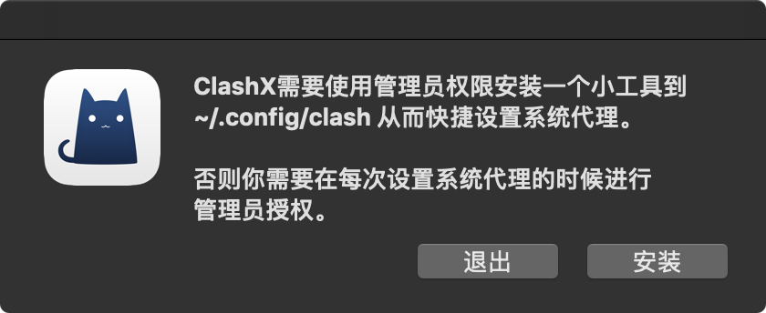

# ClashX（待补充）

* 系统要求：macOS 10.5 及以上
* 设备要求：MacBook / iMac / Mac Pro


Clash **不兼容** SSR 协议，几鸡目前以 SSR 线路为主，教程**暂写待用**。



 首次使用 ClashX ，macOS 会提醒你此应用来自未知开发者，

**请允许打开此应用。**

ClashX 首次运行会提示是否安装帮助程序（Helper）。

此帮助程序用于设置系统代理，

否则每次你通过 ClashX 变更系统系统状态（打开或关闭）时都需要输入密码，请点击「Install」，之后 macOS 会提示输入用户密码。


  
**未完，**请等待老几补充，如果您需要帮助请联系：

TG：t.me/lisuanlaoji

