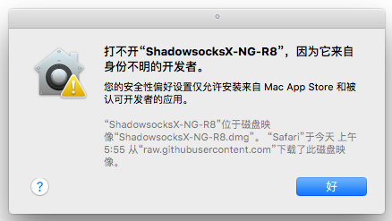
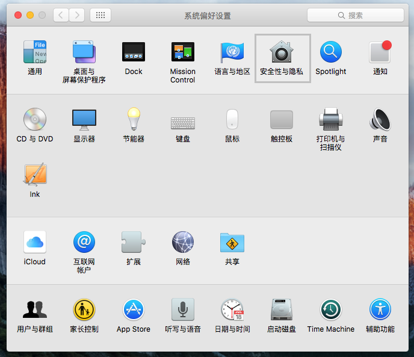
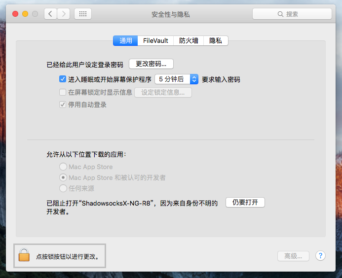
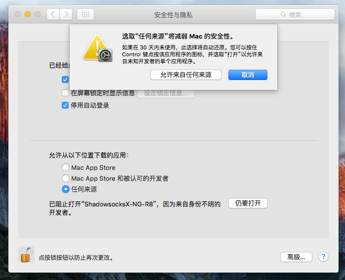
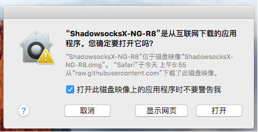
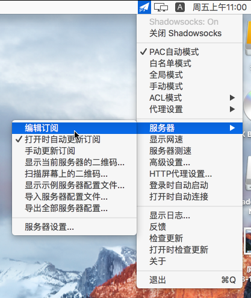
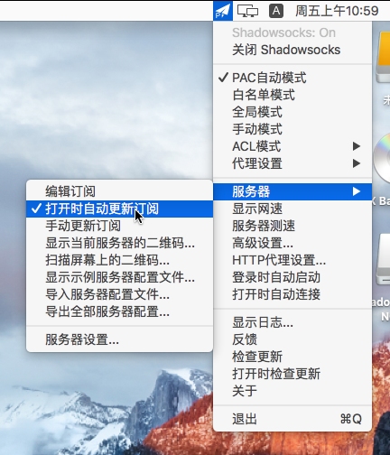
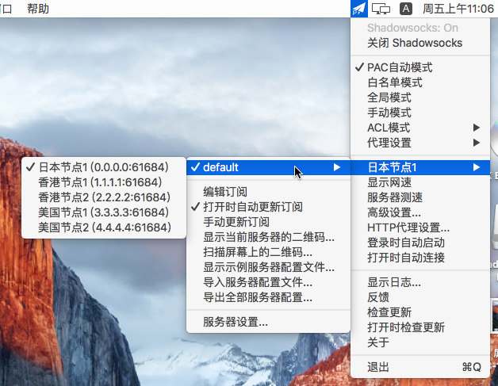

# ShadowsocksX-NG-R8

* 系统要求：macOS 10.5 及以上
* 设备要求：MacBook / iMac / Mac Pro

### **1.下载运行软件**

运行 ShadowsocksX，会提示如图，点击「好」；

### **2.设置安全隐私**

打开「系统偏好设置」，点击「安全性与隐私」；

### 3.解锁软件权限

点击左下角的小锁图标，然后提示输入密码进行解锁；

### 4.选择允许来源

### 5.再次运行程序

再次运行 ShadowsocksX 程序，点击「打开」；

### 6.复制订阅链接

在网站用户中心里，复制订阅链接

### 7.软件添加订阅

点击任务栏的小飞机，点击「服务器」-「编辑订阅」；

### 8.添加订阅连接

点击左下角「＋」，然后粘贴节点订阅链接到「订阅地址」中，并在「组名」中填写备注；

### 9.设置自动更新

点击任务栏的小飞机，点击「服务器」-「打开时自动更新订阅」；

### 10.选择节点富强

最后就可以选择一个节点进行科学上网啦

