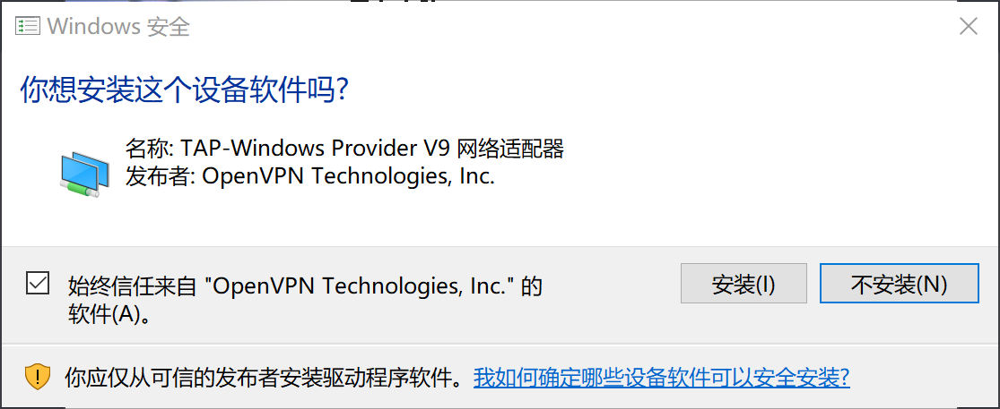
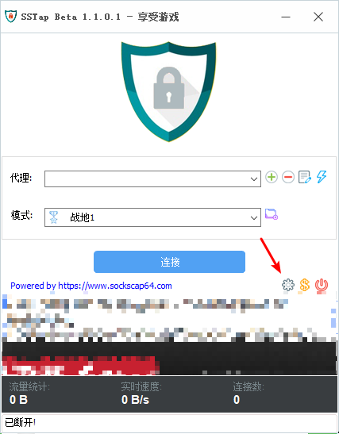
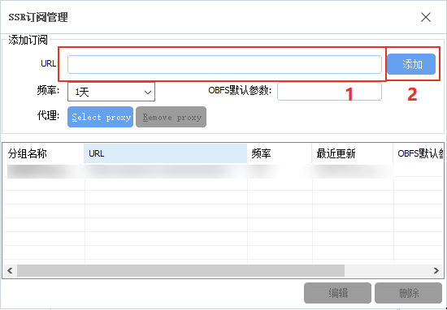
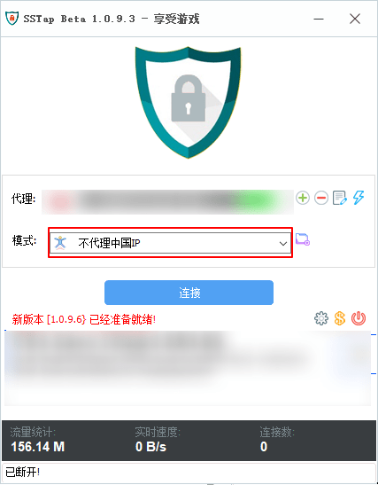

# SS-Tap - Windows

* 系统要求：Windows 7 及以上
* 软件版本：SSTap Beta 1.0.9.3 及以上
* 设备要求：Windows PC / Tablet

> 尽管 SS-Tap 宣称为游戏而生，但 SS / SSR 项目却并非为游戏设计的，其设计结构和很多代码实现都并不能提供足够优秀的游戏性能，几鸡 仍然建议有游戏加速需求的用户使用专业的游戏加速器，
>
> 此外，如果你有使用 BitTorrent 协议的需求（各类 BT/PT 下载），则应当避免在使用这些软件时开启 SS-Tap，否则 BitTorrent 流量将有极大可能被 SS-Tap 路由通过 几鸡 网络，而 几鸡 的条款和条件中明确指出不允许在 几鸡 网络上使用 BitTorrent 协议，否则将暂时或永久限制订阅或账户访问。
>
> 作者 Taro 宣称 SS-Tap 的代码没有备份，而储存代码的硬盘因为控制芯片损坏，永久丢失了这些代码，并决定放弃 SS-Tap 的开发，因此，SS-Tap 将可能在未来的系统更新中出现意料之外的问题或无法使用。

### 一. 下载

### 二. 安装

安装过程中可能遇到**提示**，**无需担心**。

这是因为 **SS-Tap** 需要使用 **OpenVPN 的 TAP 设备驱动 ，**

来**创建虚拟网卡**以实现类似 VPN 的效果。

为了 SS-Tap 能**正常运行**，请点击 **安装**。

### 三. 运行

**注意：**SS-Tap 的运行需要**管理员权限。**

打开 SS-Tap，如图所示在主界面位置点击 **齿轮图标。**

### 四. 添加订阅

点击齿轮后在弹出的菜单中选择：

**SSR 订阅** -&gt; **SSR 订阅管理**

在新的窗口中，将**订阅地址 粘贴**到 **URL** 右边的 **编辑框内**，然后点击 **添加**。

### 五. 完成订阅

操作完成后，**关闭** SSR 订阅管理的窗口，**等待几秒**后。

具体时间取决于您的网络环境，将看到 **几鸡** 节点列表，

然后在列表中选择**所需的节点**，

然后根据需求选择**所需的模式**。

**点击连接，完成爱国富强。**

